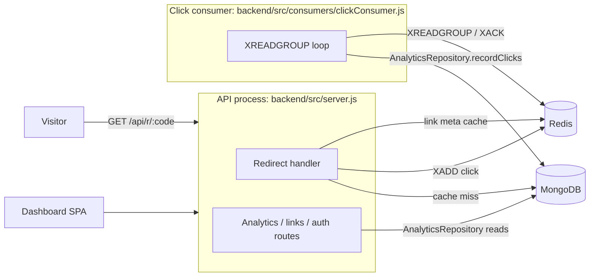

# Linkora Architecture

Linkora is a URL shortener built to run on free tiers: one Express API, one click-consumer worker, MongoDB (Atlas M0) as the only database, and one Redis database. Decisions are recorded in [docs/adr/](adr/README.md).

## Components

| Component | Responsibility | Code |
|---|---|---|
| API | HTTP API and the redirect hot path. Never writes analytics synchronously. | `backend/src/app.js`, `backend/src/server.js` |
| Click consumer | Reads the click stream, enriches events (GeoIP, user agent), records them, updates `Link.clicks`, dispatches click webhooks | `backend/src/consumers/clickConsumer.js` |
| MongoDB | Source of truth for users, links, webhooks, API keys **and analytics** | `backend/src/models/`, `backend/src/repositories/` |
| Redis | Link metadata cache, click stream, rate limits, refresh tokens, short-lived tokens | `backend/src/services/cacheService.js` |

## Click flow

1. `GET /api/r/:code` resolves the link from the Redis cache (MongoDB on a miss), runs the password, expiry and usage-limit checks, and responds with the redirect.
2. After responding, it `XADD`s a click event to the click stream. This is fire-and-forget: a Redis failure here loses that click's analytics but never fails the redirect.
3. The consumer reads batches with `XREADGROUP`, enriches each event, and writes it through the `AnalyticsRepository`. It updates `Link.clicks` idempotently and only then `XACK`s.
4. A batch that fails stays pending. `XAUTOCLAIM` hands it to a consumer again later, and because every write is keyed by the stream entry ID, the retry doesn't double count.

## Analytics

All analytics reads and writes go through `AnalyticsRepository` (`backend/src/repositories/analytics/analyticsRepository.js`). It has one implementation today, `MongoAnalyticsRepository`, and was chosen over ClickHouse to stay on free tiers ([ADR 0005](adr/0005-analytics-on-mongodb.md)). Controllers and the consumer never touch analytics collections directly.

| Method | Used by |
|---|---|
| `recordClicks(events)` | click consumer |
| `getLinkAnalytics(linkId, timeInfo, { excludeBots })` | `GET /api/analytics/link/:id`, `GET /api/public/v1/links/:code/analytics` |
| `getUserSummary(userId, timeInfo)` | `GET /api/analytics/summary/all` |
| `exportEvents(filter)` | `GET /api/analytics/export` (CSV, formula-escaped cells) |

## Failure modes

| Failure | Effect | Recovery |
|---|---|---|
| Redis down | Redirects on a cache miss still resolve from MongoDB. Click events for those redirects are lost. Login refresh, rate limits and unlock tokens fail. | Automatic reconnect (ioredis) |
| MongoDB slow or down | Cache hits keep redirecting. Cache misses, dashboard and writes fail. The consumer stops ACKing, so clicks wait in the stream. | Pending entries are retried by `XAUTOCLAIM` |
| Consumer crash mid-batch | The batch stays pending | Reclaimed by `XAUTOCLAIM` and applied exactly once (idempotent writes) |
