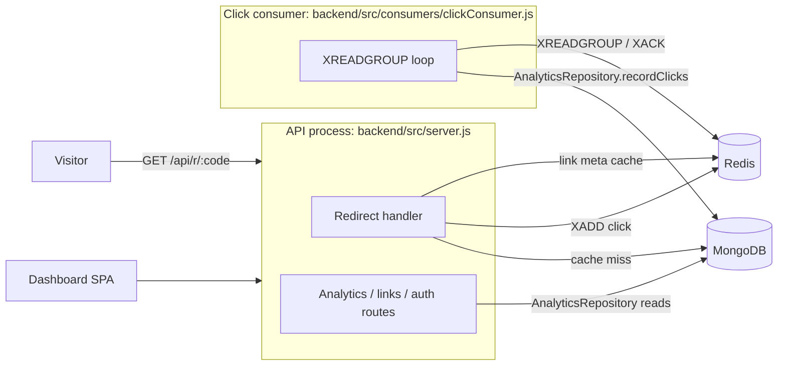

# Linkora Architecture

Linkora is a URL shortener built to run on free tiers: one Express API, one click-consumer worker, MongoDB (Atlas M0) as the only database, and one Redis database. Decisions are recorded in [docs/adr/](adr/README.md).

## Components

| Component | Responsibility | Code |
|---|---|---|
| API | HTTP API and the redirect hot path. Never writes analytics synchronously. | `backend/src/app.js`, `backend/src/server.js` |
| Click consumer | Reads the click stream, enriches events (GeoIP, user agent), records them, updates `Link.clicks`, dispatches click webhooks | `backend/src/consumers/clickConsumer.js` |
| MongoDB | Source of truth for users, links, webhooks, API keys **and analytics** | `backend/src/models/`, `backend/src/repositories/` |
| Redis (one database) | Link metadata cache, click stream, rate limits, refresh tokens, short-lived tokens, unique-visitor HyperLogLogs. Every key has a TTL or a cap ([redis-keys.md](redis-keys.md), [ADR 0006](adr/0006-single-redis-database.md)). | `backend/src/services/cacheService.js` |

## Click flow

1. `GET /api/r/:code` resolves the link from the Redis cache (MongoDB on a miss), runs the password, expiry and usage-limit checks, and responds with the redirect.
2. After responding, it `XADD`s a click event to the click stream. This is fire-and-forget: a Redis failure here loses that click's analytics but never fails the redirect.
3. The consumer reads batches with `XREADGROUP`, on its own connection, because a blocking read holds the connection. It enriches each event and writes it through the `AnalyticsRepository`, which also updates `Link.clicks`, and only then `XACK`s. While the stream is idle, the read's BLOCK doubles from 1s up to 30s, to save Redis commands ([command budget](redis-keys.md#command-budget)). A new entry still returns immediately.
4. A batch that fails stays pending. Every 5 minutes, `XAUTOCLAIM` hands entries idle for over 30s to a consumer again. Because every write is keyed by the stream entry ID, the retry doesn't double count. Worst-case retry delay is about 5.5 minutes.

## Analytics

All analytics reads and writes go through `AnalyticsRepository` (`backend/src/repositories/analytics/analyticsRepository.js`). It has one implementation, `MongoAnalyticsRepository`, and MongoDB was chosen over ClickHouse to stay on free tiers ([ADR 0005](adr/0005-analytics-on-mongodb.md)). Controllers and the consumer never touch analytics collections directly.

| Method | Used by |
|---|---|
| `recordClicks(events)` | click consumer (and the legacy backfill script) |
| `getLinkAnalytics(linkId, timeInfo, { excludeBots })` | `GET /api/analytics/link/:id`, `GET /api/public/v1/links/:code/analytics` |
| `getUserSummary(userId, timeInfo)` | `GET /api/analytics/summary/all` |
| `exportEvents(filter)` | `GET /api/analytics/export` (CSV, formula-escaped cells) |
| `deleteAnalytics({ linkId } \| { userId })` | link deletion (dashboard and public API), account deletion |

### Collections

| Collection | Shape | Retention |
|---|---|---|
| `click_events` | **Time-series**: `timeField: timestamp`, `metaField: { linkId, userId }`, one document per click with `eventId`, the enriched dimensions, `isBot` | `expireAfterSeconds` = `CLICK_EVENT_RETENTION_DAYS` (default 90). Kept in sync at startup with `collMod`. |
| `link_stats_hourly` | One document per link per UTC hour: `total`, `human`, `bot`, `dims`, `appliedIds` | TTL on `bucket` = `CLICK_EVENT_RETENTION_DAYS` |
| `link_stats_daily` | One document per link per UTC day: the same fields, plus `unique` | Kept until the link or account is deleted |
| `processed_events` | `{ _id: <stream entry ID>, state: pending\|done, createdAt }` | TTL 3 days |

`dims` maps each dimension to `{ <value>: { a, h } }`: all clicks and human clicks. The dimensions are country, city (`CC|City`), device, browser, os, referrer (`Direct` for none or localhost), utmSource, utmMedium, utmCampaign and variant. Keys are percent-encoded for `.`, `$` and `%`, because a MongoDB field name can't contain a dot. **Each map is capped** per document (country 60, city 50, referrer 50, browser and os 30, each UTM field 30, variant 20, device 10). Values past the cap count under `__other__`, shown as "Other". This is "the first N values seen in the bucket", not a true top N, and it bounds a rollup document at roughly 40 KB, including a full 1,000-ID `appliedIds` window.

### Write path (idempotent without transactions)

`recordClicks` (`mongoAnalyticsWriter.js`) can't use a multi-document transaction: time-series collections can't be written in one, and dev MongoDB is often standalone. So each step is idempotent on its own, and a batch can be replayed from any point:

1. **Claim** every event in `processed_events` (the unique `_id` is the stream entry ID). Events already `done` are skipped outright.
2. **Raw insert** into `click_events`. For events left `pending` by an interrupted attempt, only those with no raw row for that `eventId` yet are inserted. Time-series collections can't have unique indexes, which is why the ledger exists.
3. **Rollups**: one conditional upsert per event per collection, `filter: { linkId, bucket, appliedIds: { $ne: eventId } }`, with `$inc` counters and `$push appliedIds { $slice: -1000 }`. A replay matches nothing. A duplicate-key error means either a concurrent upsert created the document first, or the event is already applied; one retry tells them apart.
4. **`Link.clicks`**: the same pattern, on `Link.appliedClickIds`.
5. **Unique visitors**: one Redis command per (link, day) in the batch, a Lua script that `PFADD`s the visitors' IP hashes into `hll:visitors:<linkId>:<yyyymmdd>`, refreshes its 2-day TTL, and returns `PFCOUNT`. That count is written into the daily rollup with `$max`. Both operations are idempotent.
6. Mark the events **`done`**.

The window is 1,000 IDs and `CLICK_STREAM_BATCH_SIZE` is capped at 1,000 in `env.js`, so a batch can never evict its own IDs. A replay goes undetected only if the same bucket took more than 1,000 other clicks between the first attempt and the retry.

### Read path

- **Rollup choice**: hourly for ranges of 48 hours or less that start inside the retention window, daily otherwise (`selectRollupGranularity`). Buckets are selected with `bucket >= floor(start)`, so a range that starts mid-bucket includes the whole first bucket.
- **Monthly charts** (`ytd`, `all`) sum daily rollups per month.
- **`excludeBots=true`** reads the `h` (human) counters. The bot breakdown always shows both.
- **Raw events** are read only for recent clicks (latest 50) and the CSV export (up to 10,000 rows).

### Known approximations

| Metric | Approximation |
|---|---|
| Unique visitors | HyperLogLog (about 0.8% standard error), per link per UTC day. Ranges report the **sum of daily uniques**, so returning visitors on different days count again. A 24h range reports the uniques of the calendar days it touches. The user summary sums across links. |
| Breakdown maps | First N distinct values per bucket, the rest in "Other" |
| Range edges | Whole first bucket (hour or day) included |

### Indexes

Checked with `explain("executionStats")` against 10,000 seeded events (20 links, 2 users), producing 198 daily and 2,000 hourly documents, on MongoDB 8.2:

| Query | Index | Plan (from explain) |
|---|---|---|
| Link analytics, daily: `{ linkId, bucket: range }` | `link_stats_daily {linkId:1, bucket:1}` (unique; also the upsert target) | `IXSCAN → FETCH`, keys examined = docs examined = returned (9/9/9) |
| Link analytics, hourly: same shape | `link_stats_hourly {linkId:1, bucket:1}` (unique) | `IXSCAN → FETCH`, 12/12/12 |
| User summary: `{ userId, bucket: range }` | `{userId:1, bucket:1}` on both rollups | `IXSCAN → FETCH`, 99/99/99 |
| Hourly retention | `link_stats_hourly {bucket:1}` TTL | TTL monitor |
| Recent clicks per link: `{ meta.linkId }` sorted by `timestamp` desc, limit 50 | `click_events {meta.linkId:1, timestamp:-1}` | `IXSCAN` on the bucket-level index |
| Recent clicks per user | `click_events {meta.userId:1, timestamp:-1}` | `IXSCAN` |
| CSV export: `{ meta.linkId, timestamp: range }` | `click_events {meta.linkId:1, timestamp:-1}` | `IXSCAN` |
| Redelivery check: `{ eventId: { $in } }` | `click_events {eventId:1}` | `IXSCAN` (one per value, `OR`) |
| Ledger lookup: `{ _id: { $in } }` | `processed_events _id` | `IXSCAN(_id_)` |
| Ledger expiry | `processed_events {createdAt:1}` TTL 3 days | TTL monitor |

Every rollup query examines exactly the documents it returns. Dashboard cost therefore scales with links × buckets in range, not with clicks.

### Migrating existing data

`backend/scripts/backfill-legacy-click-events.js` replays the old `clickevents` collection through `recordClicks`. It's idempotent (the legacy `_id` becomes the event ID) and doesn't touch `Link.clicks`, which already counts those clicks.

## Failure modes

| Failure | Effect | Recovery |
|---|---|---|
| Redis down | Redirects on a cache miss still resolve from MongoDB. Click events for those redirects are lost. Login refresh, rate limits and unlock tokens fail. | Automatic reconnect (ioredis) |
| MongoDB slow or down | Cache hits keep redirecting. Cache misses, dashboard and writes fail. The consumer stops ACKing, so clicks wait in the stream. | Pending entries are retried by `XAUTOCLAIM` |
| Consumer crash mid-batch | The batch stays pending, possibly with some events `pending` in the ledger | Reclaimed by `XAUTOCLAIM`; each step is idempotent, so the replay applies only what's missing |
